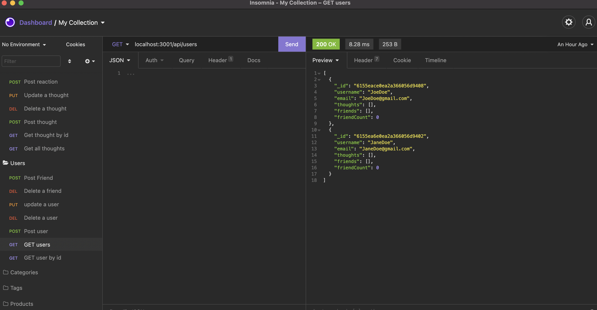

# socialnetwork

## Description

  This is the project for the week 13
  
  ## Table of Contents
  
  
  * [Installation](#installation)
  * [Usage](#usage)
  
  
  ## Installation

  - Please navigate to project folder and open Terminal/Gitbash, run npm install to retrieve the necessary libraries, and Run the following node server.js locally - npm start

  
  ## Usage 

  AS A social media startup
  I WANT an API for my social network that uses a NoSQL database
  SO THAT my website can handle large amounts of unstructured data

  ## Tools

  Tools are used Javascript, Node, Mongoose

  ## Screenshots & Additional Info

  
  
  
  The recording can be found: https://watch.screencastify.com/v/h7fAJNob3qaAmR23UgCn
  The URL to the repo: https://github.com/hikod/socialnetwork

  ## Questions 
    
  https://github.com/hikod

  Please email me for further questions at hikmetdogrul00@gmail.com